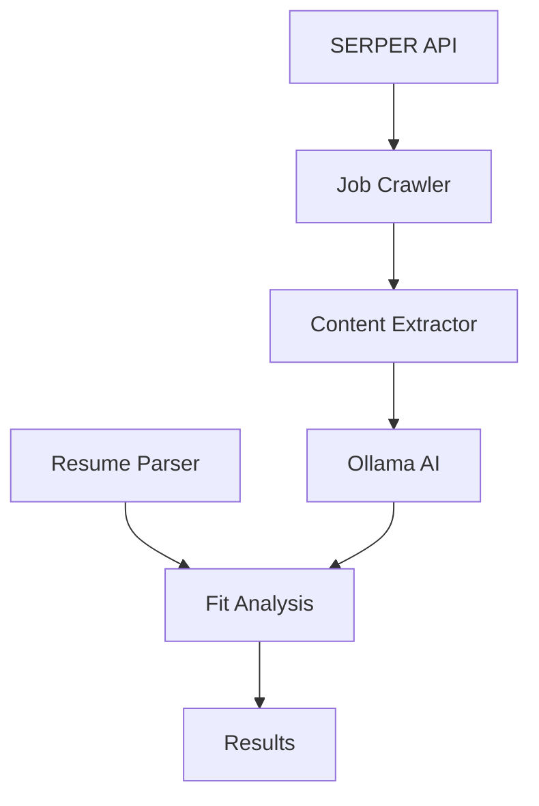

# Job Hunting Tools
## Automated Job Search and Analysis

<div class="pt-12">
  <span @click="$slidev.nav.next" class="px-2 py-1 rounded cursor-pointer" hover="bg-white bg-opacity-10">
    Press Space for next page <carbon:arrow-right class="inline"/>
  </span>
</div>

---
layout: two-cols
---

# System Overview

The system consists of several key components:

- Job Crawler
- Ollama AI Integration
- SERPER API
- PDF Resume Parser
- Fit Analysis Engine

::right::



---
layout: default
---

# EnhancedJobCrawler

Key Features:

- Intelligent content extraction
- Rate limiting per domain
- Automatic retry logic
- Resume parsing
- AI-powered analysis

```python {all|4-9|11-16|18-23}
class EnhancedJobCrawler:
    def __init__(self, resume_path: Optional[str] = None):
        # Intelligent session management
        self.session = requests.Session()
        retry_strategy = Retry(
            total=3,
            backoff_factor=0.5,
            status_forcelist=[500, 502, 503, 504]
        )
        
        # Rate limiting
        self.rate_limit = rate_limit
        self.last_request_time = {}
        
        # Resume handling
        self.resume_text = None
        if resume_path:
            self.resume_text = self._load_resume(resume_path)
```

---
layout: two-cols
---

# Content Extraction

Smart HTML parsing with fallbacks:

- Main content detection
- Noise removal
- Section identification
- Workday-specific handling

::right::

```python
def _extract_text_content(self, html: str):
    soup = BeautifulSoup(html, 'html.parser')
    
    # Try specific selectors
    selectors = [
        'main',
        '#job-content',
        '.job-description',
        '[role="main"]'
    ]
    
    # Remove noise
    for element in soup.find_all([
        'script', 'style', 'nav',
        'header', 'footer'
    ]):
        element.decompose()
```

---
layout: default
---

# Ollama AI Integration

Uses LLaMA 2 for intelligent analysis:

```python {all|2-7|9-14|16-21}
class OllamaClient:
    def __init__(self):
        self.ollama_client = Ollama(
            model="llama2",
            temperature=0.1
        )

    async def call_with_retry(self, prompt: str):
        # Retry logic for reliability
        for attempt in range(max_retries):
            result = self.ollama_client.invoke(prompt)
            if self._validate_response(result):
                return result

    def _validate_response(self, result):
        # Ensure valid JSON
        try:
            json.loads(result)
            return True
        except json.JSONDecodeError:
            return False
```

---
layout: two-cols
---

# Fit Analysis

AI-powered job fit scoring:

- Skill matching
- Experience evaluation
- Location compatibility
- Gap analysis
- Overall fit score

::right::

```json
{
  "skill_match": [
    "Python",
    "Web Scraping",
    "AI Integration"
  ],
  "experience_match": [
    "5+ years development",
    "Team leadership"
  ],
  "overall_score": 85,
  "location_compatibility": {
    "score": 100,
    "notes": ["Remote position"]
  }
}
```

---
layout: two-cols
---

# Serper API Integration

Powerful Google Jobs search capabilities:

- Site-specific targeting
- Advanced query filters
- Result merging
- Automatic pagination

::right::

```python {all|2-8|10-15}
def main():
    # Target specific job boards
    queries = [
        'site:myworkdayjobs.com | ' +
        'site:jobs.lever.co | ' +
        'site:boards.greenhouse.io ' +
        '("Head of SEO" OR "SEO Manager") ' +
        'AND remote'
    ]
    
    # Process results
    results_list = []
    for query in queries:
        results = serper_search(query, api_key)
        results_list.append(results)
```

---
layout: default
---

# Google Jobs Integration

Automated job search across platforms:

```python {all|3-8|10-15|17-22}
def serper_search(query, api_key):
    # API configuration
    url = "https://google.serper.dev/search"
    payload = json.dumps({
        "q": query,
        "num": num_results,
        "tbs": timeframe
    })

    # Execute search
    headers = {
        'X-API-KEY': api_key,
        'Content-Type': 'application/json'
    }
    response = requests.request("POST", url, headers=headers, data=payload)

    # Process results
    results = response.json()
    merged_results = merge_results([results])
    save_to_file(merged_results, 'serp_results')
    
    return merged_results
```

---
layout: center
class: text-center
---

# Thank You!

Built with Python, LLaMA 2, and ❤️

[Source Code](https://github.com/yourusername/job-hunt-tools) · [Documentation](https://docs.example.com)
